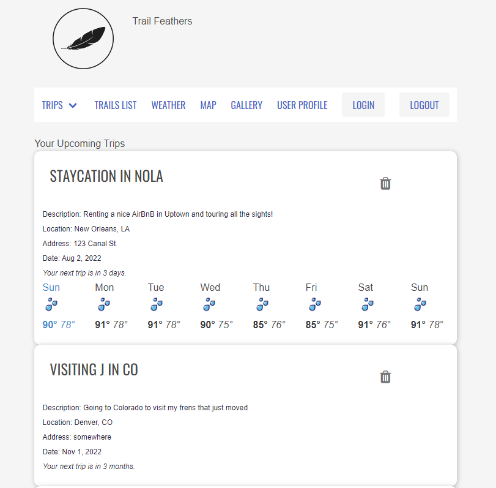
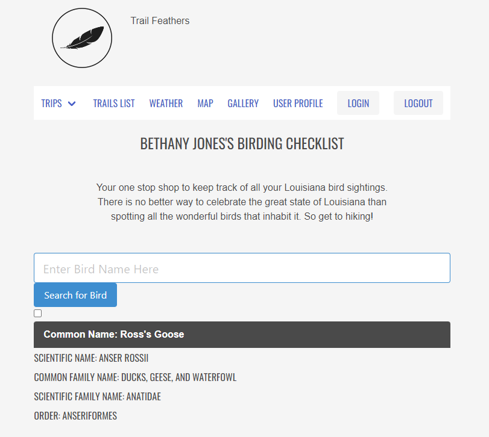
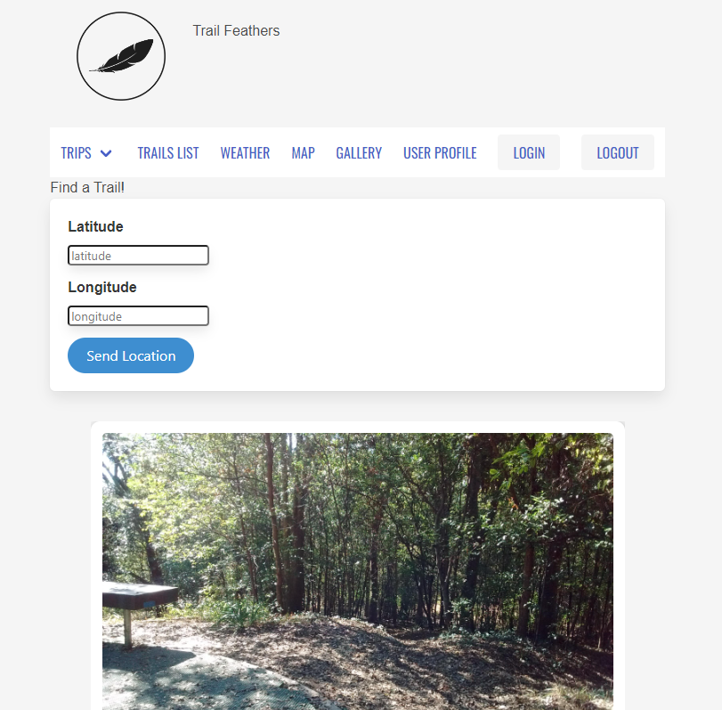
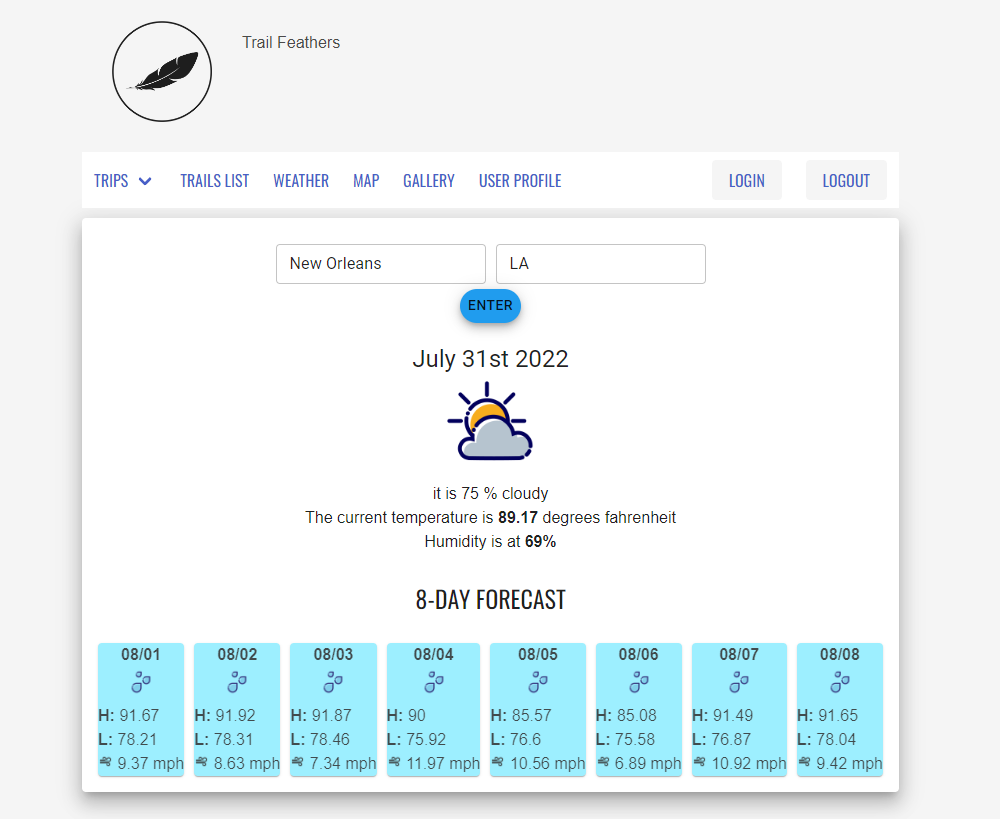

# TrailFeathers

Trail Feathers is an app for hiking and bird watching anywhere in the world! Use it to explore hiking and biking trails, organize lists of items to bring with you, and search for any North American bird.

# Team ACE

Product Owner:
Scrum Master: Caity Opelka
Development Team: Rodolfo Machirica, Rene Mercadel, John Dyer, Santo Lococo, Murphy Fleenor

# Team Work4ce

Product Owner:
Scrum Master: Caity Opelka
Development Team: Vincent Tong, Bethany Jones, Ryan Smith

# Application Walk Through

The idea is to have one stop shop for all your hiking needs, with a focus on Louisiana.

When a user opens the application they will be brought to the login page where they will be redirected to google to login.

Located at the top right of every page is a navigation burger menu which contains {x} options that will quickly navigate the user to various features of the application. From left to right are the ...

## Trips
Allows the user to view their upcoming and past trips 

### Quartermaster
Allows user to create packing lists with just a name of the list and a description, after which the list is displayed on the page.
User can click on a given list which will open a new view; and there, the user can add items that they want for that trip/packing list.

### Birding Check List
A searchable checklist of all the bird in Louisiana (according to eBird a Cornell run Bird Data API). This includes the bird's common name, scientific name, common family name, and common scientific name. Users can check any bird they have spotted along there journey to keep along the trail.

## Trail Feathers
Trail Feathers is an app for hiking and bird watching anywhere in the world! Use it to explore hiking and biking trails, organize lists of items
to bring with you, and search for any North American bird.

Search Trails is a feature for searching by latitude and longitude for hiking trails all over the world. It utilizes an external api form rapidAPI.

Setup Photo upload - using cloudinary a user can take and upload photos on to their own profile or trail profiles.

Packing List

## Tech

- Cloudinary - Image hosting library
- React-Router - Router library
- Mysql - Database
- Sequelize - ORM
- React - Framework
- Axios - http Client
- Javascript
- Node.js - Runtime Environment
- Express - Server
- Bulma - CSS Library
- eslint - Linter
- Webpack - Module Bundler
- Passport/Google OAuth - Authentication
- AWS EC2 - Deployment
- Ebird - Bird data API
- TrailApi - hiking trail data
- MaterialUI - styling

### database:

We have a mySQL/Sequelize database. We have all of our models located in database/models. The database 

### server:

We have an express server. It is set up in server/index.js. All routes, with the exception of the birdSighting and BirdList routes, are stored in server/index.js. The bird routes are stored in server/routes.

### authentication

Our authentication is handled with oauth and passport. Our passport and google strategy setup can be found in server/middleware/auth.js. Once logged in, the user has access to the whole site.

### apis

We used 3 external apis for this project:

1. RapidAPI - Trail API - https://rapidapi.com/trailapi/api/trailapi/
   This API allows us to search for any trails in the world based on latitude and longitude. It requires an API key and registration through RapidAPI, but both are free.

2. Cloudinary API - https://cloudinary.com/documentation/image_upload_api_reference
   This api allows users to upload photos onto their profiles and on trail profiles. It requires credentials, but the entire setup is free for what we've used in this project.

3. BirdSightings API - https://documenter.getpostman.com/view/664302/S1ENwy59?version=latest
   This api allows users to search for any bird species and receive data about that specific bird. It is maintained by Cornell University and is free.

### front-end

The front-end was built using React and React Router. In App.jsx we initialize our trail data so that upon refresh of trail profile, the most recent trail data is rendered. In that same file we route our links and routes for the app.

The HashRouter can be found in client/index.jsx

The styling is found in login.css and main.css.

# Dev Setup:

### Environment Variables Needed

- GOOGLE_CLIENT_ID=
- GOOGLE_CLIENT_SECRET=

- CLOUDINARY_NAME=
- CLOUDINARY_API_KEY=
- CLOUDINARY_API_SECRET=
- CLOUDINARY_URL=

- X-RapidApi-Key=2d8ea84d38msh3d15d68f2486f87p1f6cb5jsn33d451b5a65d
- X-RapidAPI-Host=trailapi-trailapi.p.rapidapi.com

- RDS_HOSTNAME=
- RDS_USERNAME=
- RDS_PASSWORD=
- RDS_PORT=

- WEATHER=
- REACT_APP_GOOGLE_MAPS_API_KEY=

## Google OAuth

Google Oauth requires a google cloud account. First create your account and then navigate to the developer console. Go to google API and create a clientID and clientSecret. This goes inside the .env file.

## WEATHER API SETUP
- create an account @ https://home.openweathermap.org/users/sign_in
- look at their availble API options at https://openweathermap.org/api
	- Subscribing to their One Call API "Pay as you call" option is nice for testing purposes. There are 2000 free calls to the api per day and we never had to exceed more than 500.
	- Instructions on how to set the parameters on their API call can be found here: https://openweathermap.org/api/one-call-3
	- You can find/generate your API key by going to your profile > My Api kEY
	- From there you can see your daily API call usage by going to Billing Plans > View Usage Statistics

## Installation/Start-up

1. First fork the repo and clone it to your local machine.
2. Collect all env keys
3. Run 'npm install' to install all dependencies
4. Open mysql, create and use a database called 'TakeAHike'
5. Run 'npm run dev' to start Webpack
6. Run 'npm start' to run the server

### Known Bugs

If you input a non-land based coordinate when searching for trails, it will return an error.

***Note: You may use only the npm modules listed in available resources to complete this task.***
> As a user, I expect to see a list of categories to help me plan my budget.

## App Mockups

